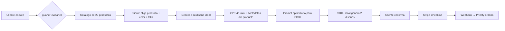

# 🎯 ESTRATEGIA GUANCHEWEAR v2.0

## 1. CATÁLOGO CURADO (20 productos)

Basado en mi análisis de Printify + márgenes + demanda:

### 👕 CAMISETAS (6 - producto estrella)
| Producto | Blueprint ID | Coste Printify | Precio Venta | Margen | Proveedor EU |
|----------|-------------|----------------|-------------|-------|-------------|
| Gildan Heavy Cotton | 6 | ~8€ | **25€** | **17€** | TSM-EU ✅ |
| Gildan Softstyle | 12 | ~9€ | 28€ | 19€ | TSM-EU |
| Next Level 3600 (Premium) | 5 | ~11€ | 30€ | 19€ | TSM-EU |
| Boxy/Oversize | 437 | ~12€ | 32€ | 20€ | TSM-EU |
| Mujer - Favorite Tee | 9 | ~9€ | 28€ | 19€ | TSM-EU |
| Kids Tee | 64 | ~8€ | 22€ | 14€ | TSM-EU |

### 👔 SUDADERAS (4)
| Producto | Coste | Precio | Margen |
|----------|-------|--------|-------|
| Gildan Heavy Blend Hoodie | ~15€ | **35€** | **20€** |
| Gildan Full Zip Hoodie | ~18€ | 40€ | 22€ |
| Crewneck Sweatshirt | ~14€ | 33€ | 19€ |
| Kids Hoodie | ~13€ | 28€ | 15€ |

### 🧢 ACCESORIOS (6)
| Producto | Coste | Precio | Margen |
|----------|-------|--------|-------|
| Gorra ajustable | ~6€ | 18€ | 12€ |
| Bolsa de tela | ~4€ | 14€ | 10€ |
| Mochila ligera | ~10€ | 28€ | 18€ |
| Calcetines personalizados | ~5€ | 15€ | 10€ |
| Toalla de playa | ~9€ | 25€ | 16€ |
| Riñonera | ~7€ | 20€ | 13€ |

### ☕ HOGAR (4)
| Producto | Coste | Precio | Margen |
|----------|-------|--------|-------|
| Taza de cerámica | ~5€ | 16€ | 11€ |
| Cojín personalizado | ~8€ | 22€ | 14€ |
| Lámina/póster A3 | ~4€ | 14€ | 10€ |
| Alfombrilla ratón | ~5€ | 15€ | 10€ |

---

## 2. IA ADAPTADA AL PRODUCTO

Cada producto tendrá **metadatos** que la IA usará para adecuar el diseño:

```javascript
// Ejemplo de metadatos de producto
const producto = {
  nombre: "Gildan Heavy Cotton",
  tipo: "camiseta",
  area_impresion: "frontal 30x40cm",
  material: "100% algodón",
  color_recomendado: "colores vibrantes contrastan bien",
  consejo_ia: "Para algodón grueso, usa trazos definidos. Evita detalles muy finos."
}
```

**GPT-4o-mini recibirá estos datos** y adecuará el prompt de imagen al producto específico. Ejemplo real:

```
Cliente: "Un lobo aullando a la luna"
Producto: Taza de cerámica 11oz
Prompt IA: "A wolf howling at moon, circular composition suitable for mug,
           wrap-around design, ceramic printing, vivid colors on white"
```

---

## 3. ARQUITECTURA TÉCNICA



### Cambios en el webhook:
- Endpoint `GET /api/catalogo` → lista productos con precios y metadatos
- `POST /api/crear-diseno` → recibe `product_id` adicional para contexto IA
- Productos almacenados en `lib/catalogo.js`

---

## 4. WOOCOMMERCE

Crearemos:
- **1 solo producto en WooCommerce**: "Producto personalizado con IA" (25€ precio base)
- El **catálogo real** se mostrará en la página /catalogo (custom HTML)
- Al confirmar diseño, se crea un pedido en WooCommerce con el producto real de Printify

Esto evita tener que sincronizar 200 productos con Printify.

---

## 5. PLAN DE EJECUCIÓN

| Día | Tarea | 
|-----|-------|
| **Hoy** | Aprobar estrategia + decidir productos finales |
| **Día 1** | Crear /catalogo con los 20 productos + metadatos |
| **Día 2** | Configurar WooCommerce (envíos, impuestos, Stripe) |
| **Día 3** | Actualizar webhook con metadatos de producto |
| **Día 4** | Probar flujo completo con 3 productos distintos |
| **Día 5** | SEO + rendimiento + lanzamiento |

---

## 6. PREGUNTAS PARA TI

Antes de empezar a programar, decide:

1️⃣ **¿Incluimos accesorios y hogar o solo ropa?**
2️⃣ **¿Quieres añadir/quitar algún producto del catálogo?**
3️⃣ **¿Precio único (25€) o cada producto con su precio?**

Cuando me digas, empiezo a construir. 🚀